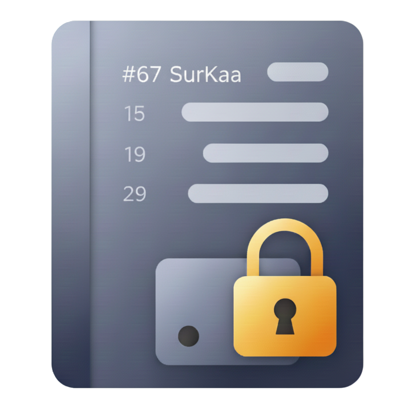

<p align="center">
  
</p>

<h1 align="center">SurKaa Pad</h1>

<p align="center">
  <strong>端到端加密的跨平台私人日记应用</strong>
</p>

<p align="center">
  
  
  
  
</p>

---

## 简介

SurKaa Pad 是一款基于 [Tauri 2](https://tauri.app/) 的端到端加密日记应用，支持 Windows 桌面端与 Android 移动端。

所有日记内容与附件在**本地完成加密**后同步至 S3 兼容的对象存储（如阿里云 OSS、AWS S3、MinIO 等），云端仅存储密文。采用零知识架构——你的主密码永远不出本地，服务商无法读取任何隐私数据。

## 核心特性

- **端到端加密** — 日记正文 AES-256-GCM，附件 AES-256-CTR 流式加密，主密码通过 Argon2id 派生密钥
- **云端同步** — S3 兼容对象存储作为加密数据后端，跨设备访问
- **富文本编辑** — 基于 Tiptap，支持图片、视频、音频、文件附件内联展示
- **全文搜索** — 本地全文检索，快速定位历史日记
- **生物识别解锁**（Android） — 指纹/面容快速解锁，免去重复输入密码
- **主题切换** — 深色 / 浅色 / 跟随系统
- **附件管理** — 图片旋转、附件单独加解密切换、拍照/录音/文件上传
- **数据导出** — 支持导出日志，一键重置配置

## 技术栈

| 层级 | 技术 |
|------|------|
| 前端框架 | Vue 3 + TypeScript |
| UI 组件库 | Quasar Framework |
| 富文本编辑器 | Tiptap |
| 桌面/移动壳 | Tauri 2 (Rust) |
| 加密 | AES-256-GCM / AES-256-CTR / Argon2id |
| 云存储 | S3 兼容协议 |
| 构建工具 | Vite + pnpm |

## 架构

```
+----------------------------------------------------+
|                  Vue 3 Frontend                    |
|  Unlock -> DiaryList -> Editor (Tiptap)            |
|  Pinia Store: config / data                        |
+----------------------------------------------------+
|                Tauri Bridge (IPC)                  |
+----------------------------------------------------+
|                  Rust Backend                      |
|  +----------+-----------+----------------+         |
|  | cryptos  | diaries   | attachments    |         |
|  | object   | caches    | tasks          |         |
|  | stream   | storages  | state          |         |
|  +----------+-----------+----------------+         |
+----------------------------------------------------+
|           S3 Compatible Storage                    |
+----------------------------------------------------+
```

### 加密流程

1. 用户输入主密码 → Argon2id 从密码 + salt 派生 256 位 DEK
2. 日记文本：JSON manifest 经 AES-256-GCM 加密后上传
3. 附件：AES-256-CTR 流式加密，支持分片上传和 Range 解密
4. 密钥仅存于内存，会话结束后即销毁

### 缓存策略

- **内存缓存** (`DashMap`) — 按日记 ID 索引，命中直接返回
- **磁盘缓存** (`LocalFileCache`) — etag 校验，避免重复下载

## 配置云存储

SurKaa Pad 需要配置一个 S3 兼容的对象存储后端才能使用。在应用解锁界面提供以下信息：

| 配置项 | 说明 |
|--------|------|
| Access Key | S3 AccessKey ID |
| Secret Key | S3 AccessKey Secret |
| Bucket | 存储桶名称 |
| Endpoint | S3 服务端点（如 `oss-cn-guangzhou.aliyuncs.com`） |

所有数据在本地加密后才上传，服务商无法解密你的数据。

> **权限建议**：为 AccessKey 仅授予对应 Bucket 的最小必要权限（读写），不要使用主账号 AK。

## 安全

SurKaa Pad 采用零知识架构设计：

- 主密码永不离开本地设备，仅用于在本地通过 Argon2id 派生加密密钥
- 所有日记正文和附件在本地加密后再上传至云端
- 云端仅存储密文，不具备解密能力
- 生物识别密钥存储在平台安全区域（Android Keystore）

## 开发

### 环境要求

- [Node.js](https://nodejs.org/) >= 18
- [pnpm](https://pnpm.io/) >= 9
- [Rust](https://www.rust-lang.org/tools/install) stable 工具链
- [Tauri 2 系统依赖](https://tauri.app/start/prerequisites/)

### 本地运行

```bash
git clone https://github.com/surkaa/surkaa-pad.git
cd surkaa-pad

pnpm install

# 桌面开发模式
pnpm tauri:msi:dev

# Android 开发模式
pnpm tauri:android:dev
```

### 构建

```bash
# 桌面 MSI 安装包
pnpm tauri:msi:build

# Android APK
pnpm tauri:android:build
```

### 项目结构

```
surkaa-pad/
├── src/                    # Vue 3 frontend
│   ├── components/         # UI components (incl. Tiptap editor)
│   ├── composables/        # Vue composables
│   ├── directives/         # Vue directives (e.g. vClickOutside)
│   ├── layout/             # App layout component
│   ├── router/             # Route config
│   ├── stores/             # Pinia stores (config, data, layout, timeout)
│   ├── utils/              # Helpers (API, markdown)
│   └── views/              # Page components (unlock, diary-list, diary-detail, diary-search, settings)
├── src-tauri/              # Rust backend
│   └── src/
│       ├── bin/            # CLI tools (oss_tool)
│       ├── cryptos/        # Encrypt/decrypt
│       ├── diaries/        # Diary CRUD, sync, search, store abstraction
│       ├── attachments/    # Attachment management
│       ├── object/         # S3 client wrapper
│       ├── caches/         # Two-layer cache
│       ├── tasks/          # Cancellable async tasks
│       ├── stream/         # Stream helpers
│       ├── storages.rs     # Remote path helpers
│       ├── state.rs        # Global state (AppState)
│       ├── error.rs        # App error types
│       ├── lib.rs          # Tauri command registration
│       ├── main.rs         # Entry point
│       └── utils/          # Common utilities
└── CLAUDE.md               # Dev reference
```

### 测试

```bash
# 前端测试
pnpm vitest -- run

# Rust 测试
cargo test

# Rust 代码检查
cargo clippy
```

## 许可证

本项目采用 Apache License 2.0 + MIT 双重许可开源。
