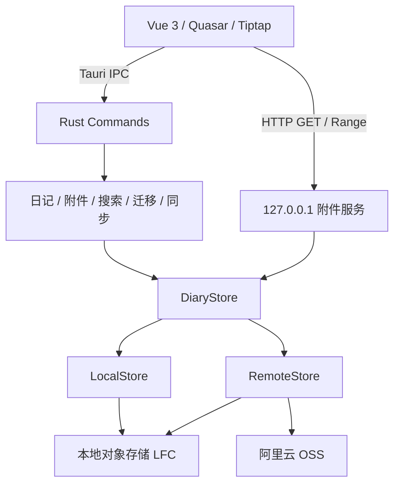

<p align="center">
  
</p>

<h1 align="center">SurKaa Pad</h1>

<p align="center">
  <strong>端到端加密的跨平台私人日记应用</strong>
</p>

<p align="center">
  
  
  
  
</p>

---

## 简介

SurKaa Pad 是一款基于 [Tauri 2](https://tauri.app/) 的本地优先、端到端加密日记应用，支持 Windows 桌面端与 Android 移动端。

无需配置云存储即可完整使用；启用阿里云 OSS 后，日记正文始终在**本地完成加密**再上传，图片和普通文件默认加密，音视频可按附件状态选择是否加密。主密码不会离开设备，存储服务无法读取加密内容。

## 核心特性

- **端到端加密能力** — 日记正文使用 AES-256-GCM，附件可使用 AES-256-CTR 流式加密，主密码通过 Argon2id 派生密钥
- **本地优先** — 无云存储配置时，日记和附件完整保存在应用本地目录
- **可选云同步** — 支持将本地密文迁移到阿里云 OSS，并在本地/远程模式间切换
- **结构化编辑** — 基于 Tiptap，支持图片、图集、视频、音频和文件附件内联展示
- **日记搜索** — 支持关键词以及图片、录音、视频、其他附件类型筛选
- **生物识别解锁**（Android） — 指纹/面容快速解锁，免去重复输入密码
- **主题切换** — 深色 / 浅色 / 跟随系统
- **附件管理** — 图片旋转、附件单独加解密切换、拍照/录音/文件上传
- **数据导出** — 支持导出日志，一键重置配置

## 技术栈

| 层级 | 技术 |
|------|------|
| 前端框架 | Vue 3 + TypeScript |
| UI 组件库 | Quasar Framework |
| 富文本编辑器 | Tiptap |
| 桌面/移动壳 | Tauri 2 (Rust) |
| 加密 | AES-256-GCM / AES-256-CTR / Argon2id |
| 云存储 | 阿里云 OSS（基于定制 rust-s3 客户端） |
| 构建工具 | Vite + pnpm |

## 架构



本地模式下，LFC 是实际持久化存储；远程模式下，OSS 是主要存储，LFC 作为写透缓存。开启云存储时执行一次本地到云端迁移，关闭时执行一次云端到本地迁移，日常云模式写入则直接更新 OSS 和本地缓存。

### 加密流程

1. 用户输入主密码 → Argon2id 从密码 + salt 派生 256 位 DEK
2. 日记内容：V3 结构化 JSON manifest 经 AES-256-GCM 加密后写入当前存储
3. 附件：AES-256-CTR 流式加密，支持分片上传和 Range 解密
4. 密钥仅存于内存，会话结束后即销毁

### 缓存策略

- **内存缓存** (`DashMap`) — 按日记 ID 索引，命中直接返回
- **本地对象存储** (`LocalFileCache`) — 本地模式下保存全部数据，远程模式下通过 ETag 校验避免重复下载
- **附件 HTTP 服务** — 仅监听回环地址，使用随机令牌并支持 Range 请求及流式 CTR 解密

## 配置云存储

云存储是可选功能。你可以首次启动时直接选择本地存储，也可以稍后在设置页面配置阿里云 OSS。启用时需要提供：

| 配置项 | 说明 |
|--------|------|
| Access Key | 阿里云 AccessKey ID |
| Secret Key | 阿里云 AccessKey Secret |
| Bucket | 存储桶名称 |
| Endpoint | S3 服务端点（如 `oss-cn-guangzhou.aliyuncs.com`） |

所有数据在本地加密后才上传，服务商无法解密你的数据。

> **权限建议**：为 AccessKey 仅授予对应 Bucket 的最小必要权限（读写），不要使用主账号 AK。

## 安全

SurKaa Pad 采用零知识架构设计：

- 主密码永不离开本地设备，仅用于在本地通过 Argon2id 派生加密密钥
- 启用云存储时，日记正文和选择加密的附件在本地加密后再上传
- 云端无法解密日记正文及加密附件；未启用附件加密的音视频会按原始内容存储
- 生物识别密钥存储在平台安全区域（Android Keystore）

## 开发

### 环境要求

- [Node.js](https://nodejs.org/) >= 18
- [pnpm](https://pnpm.io/) >= 9
- [Rust](https://www.rust-lang.org/tools/install) stable 工具链
- [Tauri 2 系统依赖](https://tauri.app/start/prerequisites/)

当前部分 Rust 和 Tauri 插件依赖使用 `../Forks` 下的本地仓库（见 `Cargo.toml` 和 `package.json`）。在迁移到固定 Git revision 或发布版本前，干净环境需要先准备对应 Fork，才能完整安装和构建。

### 本地运行

```bash
git clone https://github.com/surkaa/surkaa-pad.git
cd surkaa-pad

pnpm install

# 桌面开发模式
pnpm tauri:msi:dev

# Android 开发模式
pnpm tauri:android:dev
```

### 构建

```bash
# 桌面 MSI 安装包
pnpm tauri:msi:build

# Android APK
pnpm tauri:android:build
```

### 项目结构

```
surkaa-pad/
├── src/                    # Vue 3 frontend
│   ├── components/         # UI components (incl. Tiptap editor)
│   ├── composables/        # Vue composables
│   ├── directives/         # Vue directives (e.g. vClickOutside)
│   ├── layout/             # App layout component
│   ├── router/             # Route config
│   ├── stores/             # Pinia stores (config, data, layout, timeout)
│   ├── utils/              # Helpers (API, markdown)
│   └── views/              # Page components (unlock, diary-list, diary-detail, diary-search, settings)
├── src-tauri/              # Rust backend
│   └── src/
│       ├── bin/            # CLI tools (oss_tool)
│       ├── cryptos/        # Encrypt/decrypt
│       ├── diaries/        # Diary CRUD, sync, search, store abstraction
│       ├── attachments/    # Attachment management
│       ├── object/         # S3 client wrapper
│       ├── caches/         # Two-layer cache
│       ├── tasks/          # Cancellable async tasks
│       ├── stream/         # Stream helpers
│       ├── storages.rs     # Remote path helpers
│       ├── state.rs        # Global state (AppState)
│       ├── error.rs        # App error types
│       ├── lib.rs          # Tauri command registration
│       ├── main.rs         # Entry point
│       └── utils/          # Common utilities
├── AGENTS.md               # 开发与测试规范
└── TODO.md                 # 项目级待办和架构债务
```

### 测试

```bash
# 前端测试（项目根目录）
pnpm test

# Rust 测试（src-tauri 目录）
cargo test

# Rust 代码检查
cargo clippy
```

### OSS 测试桶管理

`src-tauri/src/bin/oss_tool.rs` 提供了一个 CLI 工具，用于管理测试用的 OSS 存储桶（列出、删除、上传、下载等操作）。需在 `src-tauri/.env` 中配置 `ALIYUN_KEY`、`ALIYUN_SECRET`、`ALIYUN_BUCKET_NAME`、`ALIYUN_ENDPOINT`。

```bash
cargo run --bin oss_tool -- <command>
```

需要 OSS 的 Rust 测试使用唯一对象前缀隔离：通过后自动清理，失败时保留对象，并在测试日志中打印对应前缀。

## 许可证

本项目采用 Apache License 2.0 + MIT 双重许可开源。
